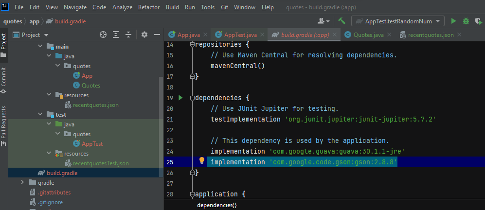

# quotes

This file contain Lab: 08 - OO Design and GSON.

My partner in this lab:Tamara Bassam.

This lab contain the following classes:

## App Class

main function which will read and parse a json file data using Gson and JsonReader and set those data into Class Qoute and print a random qoute.

## Qoutes Class

Its a class to reshape the quotes we read from the json file into wanted shape.

## Usage

To get random qoute just type $ gradle run and it will print random qoute from the array list for you.

How to run the App:
clone the repo from GitHub and open the project folder inside your IDE then open file name "build.gradle"copy and paste this line inside the dependencies in that folder "implementation 'com.google.code.gson:gson:2.8.8'" as in the following image.

To test the application you can run `./gradlew test`.
